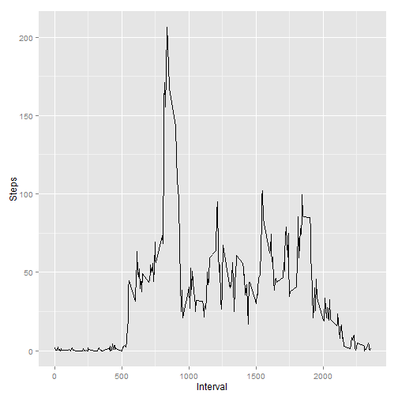
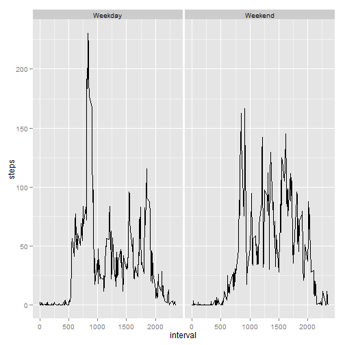

## Loading and preprocessing the data

```r
suppressPackageStartupMessages(library(lubridate))
suppressPackageStartupMessages(library(dplyr))
suppressPackageStartupMessages(library(ggplot2))
unzip("activity.zip")
activity <- tbl_df(read.csv("activity.csv"))
activity$date <- ymd(activity$date)
# Sum of steps per day
per_day <- activity %>% 
      group_by(date) %>%
      summarise(sum(steps,na.rm=T))
colnames(per_day) <- c("date","steps")
# Mean of steps per interval
per_interval <- activity %>%
      group_by(interval) %>%
      summarise(mean(steps,na.rm=T))
colnames(per_interval) <- c("interval","steps_mean")
```


## What is mean total number of steps taken per day?

```r
qplot(steps,data=per_day)
```

```
## stat_bin: binwidth defaulted to range/30. Use 'binwidth = x' to adjust this.
```

 

```r
mean = round(mean(per_day$steps,na.rm=T),0)
median = median(per_day$steps,na.rm=T)
```

The mean total number of steps taken per day is 9354 and the median total number of steps taken per day is 10395

## What is the average daily activity pattern?

```r
qplot(per_interval$interval,per_interval$steps_mean,
      xlab="Interval",ylab="Steps",geom="line")
```

 

```r
max_interval = subset(per_interval,steps_mean==max(per_interval$steps_mean))
```

The 5-minute interval with the maximum number of steps (206.1698113) was minute 835 to 840

There are 2304 missing rows in our dataset.

## Imputing missing values

```r
activity <- merge(activity,per_interval,by="interval",all.x=T)
activity$steps <- ifelse(is.na(activity$steps),activity$steps_mean,activity$steps)
```


```r
per_day <- activity %>% 
      group_by(date) %>%
      summarise(sum(steps,na.rm=T))
colnames(per_day) <- c("date","steps")
per_interval <- activity %>%
      group_by(interval) %>%
      summarise(mean(steps,na.rm=T))
colnames(per_interval) <- c("interval","steps_mean")
qplot(steps,data=per_day)
```

```
## stat_bin: binwidth defaulted to range/30. Use 'binwidth = x' to adjust this.
```

 

```r
mean = round(mean(per_day$steps,na.rm=T),0)
median = median(per_day$steps,na.rm=T)
# Can't seem to change the mean and median values from showing up in scientific notations
```

The mean total number of steps taken per day after imputation is 1.0766 &times; 10<sup>4</sup> and the median total number of steps taken per day is 1.0766 &times; 10<sup>4</sup>


## Are there differences in activity patterns between weekdays and weekends?

```r
activity$day = weekdays(activity$date)
## If the "day" begins with an "S" character, code as weekend, else weekend.
activity$weekday = as.factor(ifelse(grepl("^S",activity$day)==T,"Weekend","Weekday"))
```


```r
summary_activity = activity %>%
      group_by(interval,weekday) %>%
      summarize(steps = mean(steps))
ggplot(summary_activity,aes(interval,steps)) + geom_line() + facet_grid(. ~ weekday)
```

 


